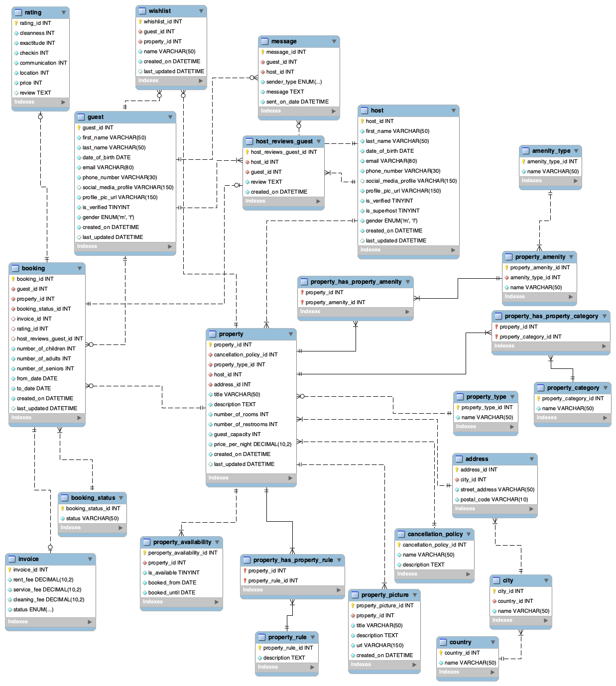
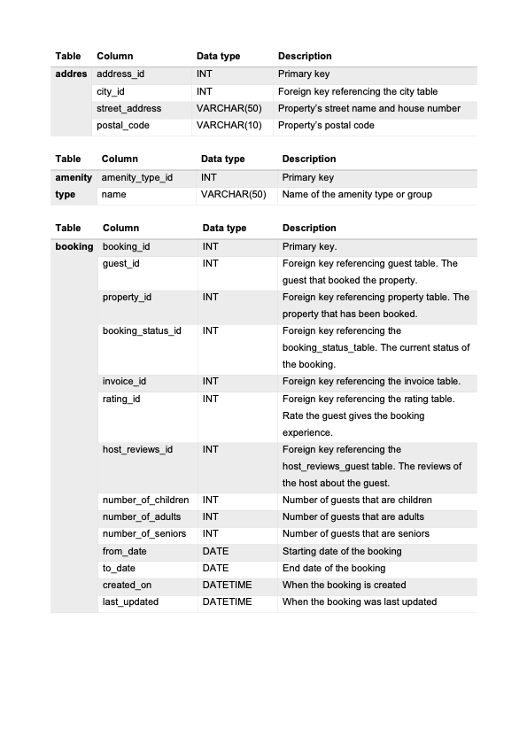
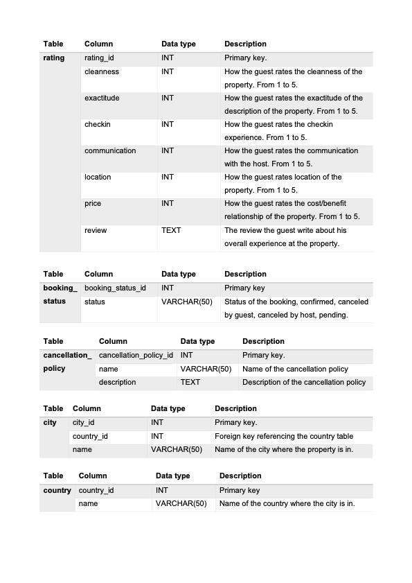
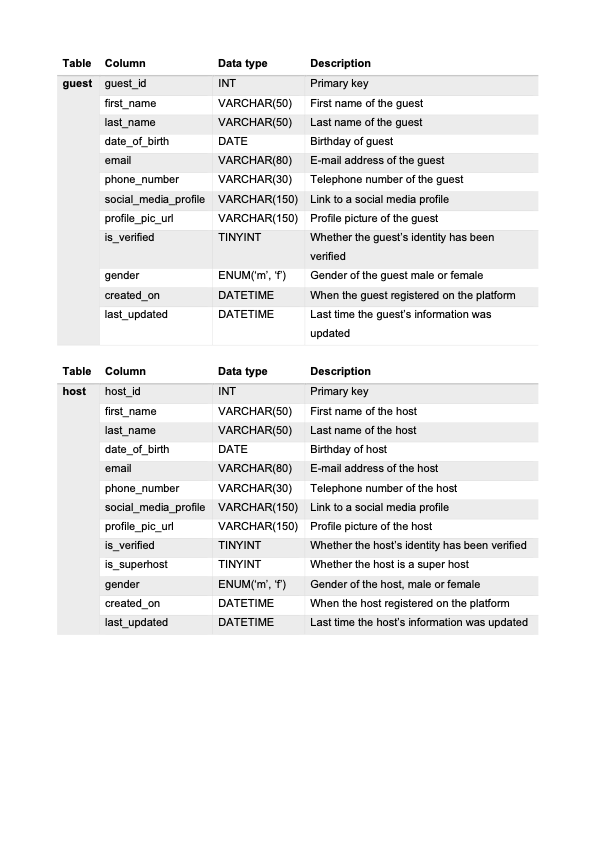
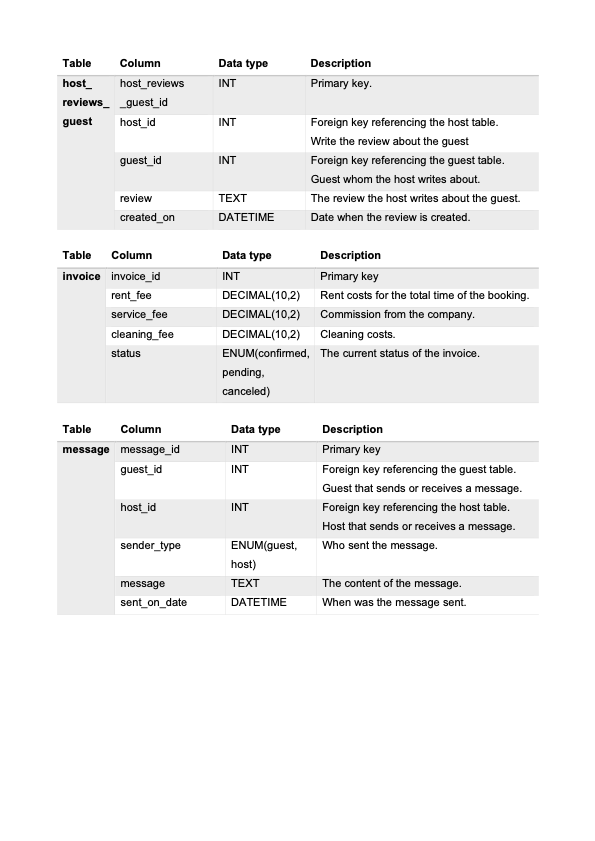
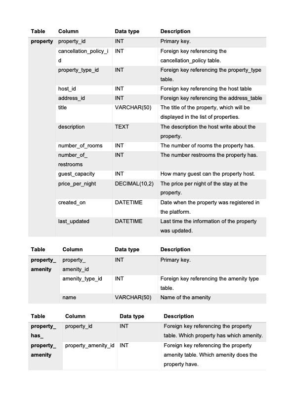
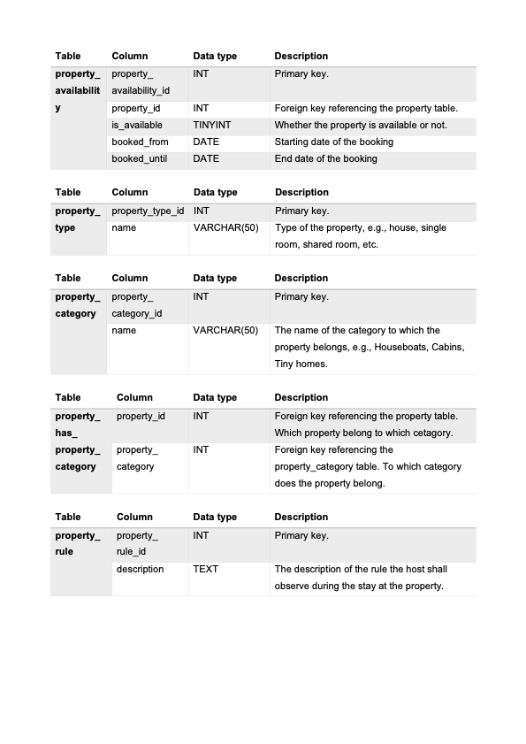
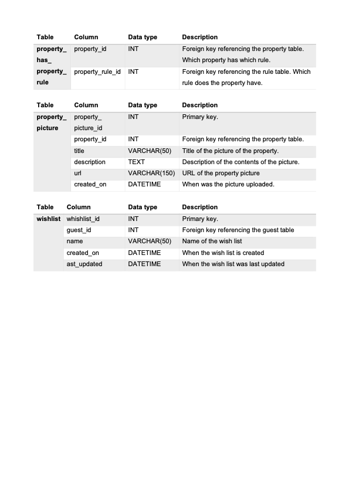

# IU International University of Applied Sciences

## Course: Build a Data Mart in SQL (DLBDSPBDM01)
The task for this project is to build a database for storing and processing information for a use case similar to Airbnb. The database should provide the ability to manage the booking of apartment and bedrooms together with information about the users.

### Objective
To understand how a database for an application should be setup, this includes the definition of requirements, creating an Entity Relationship Diagram and implementing the database in a RDBMS.

### Selected RDBMS
This project was implemented using:

1. MySQL
2. MySQL Workbench

## Entity Relationship Diagram

## Data Dictionary

